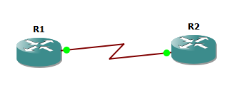

# Laboratory 1 - SYSLOG, SSH, NTP, PAP, CHAP
## I. Giới thiệu
1. Ghi log tập trung (Syslog):
- Sử dụng để thu thập và lưu trữ thông tin hệ thống từ các thiết bị mạng một cách tập trung.
- Link tham khảo: [https://datatracker.ietf.org/doc/html/rfc5424](https://datatracker.ietf.org/doc/html/rfc5424)
2. Truy cập từ xa an toàn (SSH):
- Giao thức bảo mật cho phép truy cập dòng lệnh đến các thiết bị từ xa.
- Link tham khảo: [https://datatracker.ietf.org/doc/html/rfc4251](https://datatracker.ietf.org/doc/html/rfc4251)
3. Đồng bộ thời gian mạng (NTP):
- Giao thức giúp đồng bộ hóa thời gian hệ thống giữa các thiết bị trên mạng.
- Link tham khảo: [https://datatracker.ietf.org/doc/html/rfc5905](https://datatracker.ietf.org/doc/html/rfc5905)
4. Xác thực bằng PAP (Password Authentication Protocol):
- Một phương thức xác thực cơ bản qua mạng, thường dùng trong PPP.
- Link tham khảo: [https://datatracker.ietf.org/doc/html/rfc1334](https://datatracker.ietf.org/doc/html/rfc1334)
5. Xác thực bằng CHAP (Challenge-Handshake Authentication Protocol):
- Một giao thức xác thực bảo mật hơn PAP, sử dụng cơ chế thử thách-đáp ứng. 
- Link tham khảo: [https://datatracker.ietf.org/doc/html/rfc1994](https://datatracker.ietf.org/doc/html/rfc1994)
## II. Các công cụ cần thiết
- GNS3: [https://www.gns3.com/software/download](https://www.gns3.com/software/download)
- GNS3 VM: [https://www.gns3.com/software/download-vm](https://www.gns3.com/software/download-vm)
- Router IOS (Cisco IOS image): [https://drive.google.com/file/d/1nKteBUix69_-A0rxhxAovwmZt0O8Nq0v](https://drive.google.com/file/d/1nKteBUix69_-A0rxhxAovwmZt0O8Nq0v)
- VMware Workstation: [https://www.vmware.com/products/desktop-hypervisor/workstation-and-fusion](https://www.vmware.com/products/desktop-hypervisor/workstation-and-fusion)
- Ubuntu Server: [https://ubuntu.com/download/server](https://ubuntu.com/download/server)
## III. Cài đặt công cụ và chuẩn bị thực hành
1. Cài VMWare Workstation: Mở file cài đặt .exe và làm theo các bước mặc định (cứ nhấn “Next” cho đến khi hoàn tất).
2. Tạo máy ảo và cài đặt Ubuntu Server
- Mở VMWare, chọn "Create a New Virtual Machine"
- Làm theo hướng dẫn để tạo máy ảo mới
- Chọn file cài Ubuntu Server (.iso) và cài đặt hệ điều hành lên máy ảo đó
3. Cài đặt GNS3: Mở file cài đặt .exe và làm theo các bước mặc định (cứ nhấn “Next” cho đến khi hoàn tất).
4. Cài đặt GNS3 VM: Mở VMware Workstation, vào File > Open... và chọn file .ova của GNS3 VM để nhập (import).
5. Cấu hình Router IOS:
- Mở GNS3 -> Run the appliance on my local computer
- Đặt tên dự án và đường dẫn lưu dự án
- Vào menu Edit -> Preferences ... -> IOS Routers -> New -> Chọn file .image -> (cứ nhấn "Next" cho đến khi hoàn tất) -> OK
6. Bật Enable the GNS3 VM trên GNS3
- Vào menu Edit -> Preferences ... GNS3 VM -> Check vào Enable the GNS3 VM -> Chọn GNS3 VM vừa import trên VMware -> OK
7. Tạo Node Ubuntu Server for GNS3
- Vào menu Edit -> Preferences ... -> VMware VMs -> New -> Chọn Ubuntu Server -> Finish -> Ok
## IV. Mô hình mạng thực hành

1. Để có thể kết nối Ubuntu Server với SWitch: chúng ta cần khởi động Ubuntu Server và thay đổi Network Addapter về Read-only
2. Cấu hình Cloud trong GNS3, thêm card mạng VMnet8
3. Cấu hình Router để Ubuntu Server có thể kết nối được với Internet
- Giao diện phía trong (VMnet1)
```
R1#configure terminal
R1(config)#interface FastEthernet0/0
R1(config-if)#ip address 192.168.106.254 255.255.255.0
R1(config-if)#ip nat inside 
R1(config-if)#no shutdown
R1(config-if)#exit
```
- Giao diện phía ngoài (VMnet8)
```
R1(config)#interface FastEthernet1/1
R1(config-if)#ip address dhcp
R1(config-if)#ip nat outside
R1(config-if)#no shutdown
R1(config-if)#exit
R1(config)#end
R1#write memory
```
- Access list định nghĩa mạng phía trong: `R1(config)#access-list 1 permit 192.168.106.0 0.0.0.255`
- Cấu hình NAT overload: `R1(config)#ip nat inside source list 1 interface FastEthernet1/1 overload`
- Đặt default route: `R1(config)#ip route 0.0.0.0 0.0.0.0 192.168.41.2
- Các câu lệnh kiểm tra trên router
```
R1#show ip interface brief
R1#show ip router
```
- Cấu hình IP trên Ubuntu Server: `sudo nano /etc/netplan/01-netcfg.yaml`
```
network:
  version: 2
  renderer: networkd
  ethernets:
    ens33:
      dhcp4: no
      addresses:
        - 192.168.106.100/24
      routes:
        - to: default
          via: 192.168.106.254
      nameservers:
        addresses:
          - 8.8.8.8
          - 8.8.4.4
```
- Áp dụng thay đổi: `sudo netplan apply`
- Kiểm tra: `ip route`
Kết quả mong đợi: default via 192.168.106.254 dev ens33
## V. Nội dung thực hành
1. Cấu hình Ubuntu Server (Syslog Server)
- Cài đặt rsyslog (thường có sẵn) hoặc syslog-ng
```
sudo apt update
sudo apt install rsyslog
```
- Cấu hình rsyslog để nhận log từ xa:
  + Chỉnh sửa file cấu hình rsyslog: `sudo nano /etc/rsyslog.conf`
```
# provides UDP syslog reception
module(load="imudp")
input(type="imudp" port="514")

# provides TCP syslog reception
# module(load="imtcp")
# input(type="imtcp" port="514")
```
  + Tạo file log riêng cho router: `sudo nano /etc/rsyslog.d/router.conf`
```
if ($fromhost-ip == '192.168.106.254') then {
    /var/log/router.log
    stop
}
```
  + Khởi động lại dịch vụ rsyslog:
```
sudo systemctl restart rsyslog
sudo systemctl enable rsyslog
```
  + Kiểm tra trạng thái cổng mở
```
sudo systemctl status rsyslog
sudo ufw allow 514/udp # Nếu UFW đang hoạt động
sudo ufw allow 514/tcp # Nếu dùng TCP
```
- Cấu hình Router trên GNS3 (Syslog Client)
```
Router#conf t
Router(config)#logging <IP_syslog_server> # Địa chỉ IP của Ubuntu Server
Router(config)#logging trap informational # Mức độ log gửi đi (0-7, informational = 6)
Router(config)#logging console # Cấu hình gửi thông báo log lên màn hình (tùy chọn)
Router(config)#service timestamps log datetime msec #Ghi hostname trong log
Router(config)#logging source-interface FastEthernet0/0 # Sử dụng interface này làm nguồn khi gửi log
Router(config)#logging on # Đảm bảo logging được bật (thường là mặc định)
Router(config)#end
Router#write memory
```
Mức độ log:
0: emergencies
1: alerts
2: critical
3: errors
4: warnings
5: notifications
6: informational
7: debugging

- Kiểm tra Log nhận được trên Server
  + Trên Router thực hiện các hành động để tạo Log
```
Router#configure terminal
Router(config)#interface Loopback0
Router(config-if)#ip address 1.1.1.1 255.255.255.0
Router(config-if)#no shutdown
Router(config-if)#exit
Router(config)#end
Router#exit
```
  + Trên Ubuntu Server kiểm tra file log: `tail -f /var/log/router.log`
2. Cấu hình SSH
- Trên Router Cisco:
  + Đặt hostname và domain-name: Cần thiết để tạo khóa mã hóa.
```
Router#configure terminal
Router(config)#hostname R1
Router(config)#ip domain-name lab.local
```
  + Tạo người dùng local: `Router(config)#username admin privilege 15 secret Cisco123`

Lưu ý: privilege 15 = quyền cao nhất. secret mã hóa mật khẩu mạnh.
  + Tạo khóa mã hóa RSA:
```
Router(config)#crypto key generate rsa
How many bits in the modulus [512]: 1024 # Nên chọn 1024 hoặc 2048 để tăng cường bảo mật
```

  + Cấu hình VTY lines cho SSH:
```
Router(config)#line vty 0 4
Router(config-line)#transport input ssh # Chỉ cho phép SSH, không cho phép Telnet
Router(config-line)#login local # Sử dụng cơ sở dữ liệu người dùng local
Router(config-line)#exit
```
  + Cấu hình SSH version (tùy chọn nhưng khuyến nghị): `R1(config)#ip ssh version 2 # Nên dùng SSHv2 để bảo mật hơn`
  + Cấu hình timeout và retry (tùy chọn)
```
Router(config)#ip ssh time-out 60
Router(config)#ip ssh authentication-retries 3
```

- Trên Máy tính Client kiểm tra kết nối SSH: `ssh admin@<IP_router>`
  openssh-client -y
3. Cấu hình NTP
- Cài đặt NTP Server trên Ubuntu Server:
  + Cài đặt NTP server (chrony hoặc ntp): chrony được khuyến nghị cho các phiên bản Ubuntu Server mới hơn.
```
sudo apt update
sudo apt install chrony -y
```
  + Chỉnh sửa file cấu hình chrony: `sudo nano /etc/chrony/chrony.conf `
  + Thêm dòng sau để cho phép Router R1 truy cập (thay 192.168.100.0/24 bằng dải mạng của bạn):
```
local stratum 8
allow 192.168.100.0/24
server 127.127.1.1 prefer
```
    Kiểm tra và sửa đổi các dòng pool hoặc server để chrony tự đồng bộ với các NTP server công cộng (ví dụ: pool ntp.ubuntu.com iburst). Lưu file và thoát.
  + Khởi động lại dịch vụ chrony:
```
sudo systemctl restart chrony
sudo systemctl enable chrony
```
  + Kiểm tra trạng thái dịch vụ và mở port 123 (nếu có tường lửa):
```
sudo systemctl status chrony
sudo ufw allow 123/udp # Nếu UFW đang hoạt động
```
- Cấu hình trên Router R1 (NTP Client)
  + Đặt múi giờ và thời gian (tùy chọn nhưng khuyến nghị):
```
R1(config)#clock timezone ICT 7
R1#clock set 10:00:00 07 Jun 2025 # Cấu hình thời gian gần đúng trước khi đồng bộ
```
  - Cấu hình NTP Server:
```
R1(config)#ntp server 192.168.106.100 source FastEthernet0/0 #prefer # Địa chỉ IP của Ubuntu Server
Lưu ý: prefer ưu tiên server này nếu có nhiều server NTP.
```
- Kiểm tra NTP (Router R1):
  + Kiểm tra trạng thái đồng bộ NTP: `R1#show ntp status #Bạn sẽ thấy trạng thái "Clock is synchronized" hoặc tương tự.`
  + Kiểm tra các mối quan hệ NTP: `R1#show ntp associations #Bạn sẽ thấy Ubuntu Server được liệt kê là NTP peer.`
  + Kiểm tra thời gian hệ thống:`R1#show clock detail #Thời gian trên Router R1 sẽ được đồng bộ với Ubuntu Server.`

4. Cấu hình PAP
   


a) Cấu hình IP cho các interface nối trực tiếp:
- Cấu hình trên R1:
```
R1(config)#interface serial1/0
R1(config-if)#ip address 10.0.0.1 255.255.255.252
R1(config-if)#no shutdown
R1(config-if)#encapsulation ppp # Đặt encapsulation là PPP
```
- Cấu hình trên R2:
```
R2(config)#interface serial1/0
R2(config-if)#ip address 10.0.0.2 255.255.255.252
R2(config-if)#no shutdown
R2(config-if)#encapsulation ppp # Đặt encapsulation là PPP
```
Kiểm tra Ping: Sau khi cấu hình IP và encapsulation, ping giữa R1 và R2 để đảm bảo kết nối vật lý đã hoạt động.

b) Cấu hình PAP trên R1 (Authenticator) và R2 (Peer)
Nguyên lý PAP: Bên yêu cầu (peer) gửi username và password dạng clear-text. Bên xác thực (authenticator) kiểm tra.

Cấu hình trên R1 (Authenticator):

- Tạo người dùng local cho R2: Username và password này phải khớp với thông tin mà R2 sẽ gửi: `R1(config)#username R2_peer password cisco # Username R2_peer, password cisco`
- Áp dụng xác thực PAP trên interface:
```
R1(config)#interface serial1/0
R1(config-if)#ppp authentication pap
```
Cấu hình trên R2 (Peer):
- Cấu hình gửi username và password PAP:
```
R2(config)#interface serial1/0
R2(config-if)#ppp pap sent-username R2_peer password cisco # Phải khớp với username/password trên R1
```
c) Kiểm tra PAP
- Trên Router R1: `R1#show interface serial1/0`
Tìm dòng "Line protocol is up", "PPP is up" và "LCP is up" và "authentication successful".

`R1#debug ppp authentication`
(Để xem quá trình xác thực PAP diễn ra, sau đó tắt bằng no debug ppp authentication hoặc undebug all).

- Trên Router R2:

`R2#show interface serial1/0`
Tương tự, kiểm tra trạng thái "Line protocol is up" và "PPP is up".

5. Cấu hình CHAP (Challenge-Handshake Authentication Protocol)
a) Gỡ bỏ cấu hình PAP cũ trên R1 và R2: Trên R1:
```
R1(config)#interface serial1/0
R1(config-if)#no ppp authentication pap
```
Trên R2:
```
R2(config)#interface FastEthernet0/0
R2(config-if)#no ppp pap sent-username R2_peer password cisco
```
b) Cấu hình CHAP trên R1 (Authenticator) và R2 (Peer)

Nguyên lý CHAP: Bên xác thực gửi một "thử thách" (challenge). Bên yêu cầu tính toán một giá trị băm (hash) dựa trên thử thách và mật khẩu bí mật, sau đó gửi "đáp ứng" (response) lại. Bên xác thực tự tính toán giá trị băm và so sánh. Mật khẩu không bao giờ được gửi qua mạng.

Cấu hình trên R1 (Authenticator):

Tạo người dùng local cho R2: Username phải khớp, mật khẩu phải khớp.
```
R1(config)#hostname R1_auth
R1_auth(config)username R2_peer password cisco # Password phải khớp với R2
R1_auth(config)#interface serial1/0
R1_auth(config-if)#ppp authentication chap
```
Cấu hình trên R2 (Peer):

Cấu hình gửi username cho CHAP:
```
R2(config)#hostname R2_peer
R2_peer(config)#username R1_auth password cisco # Tạo username/password cho bên xác thực (R1_auth)
R2_peer(config)#interface serial1/0
R2_peer(config-if)#ppp chap hostname R2_peer # Gửi hostname làm username trong CHAP
R2_peer(config-if)#ppp authentication chap
```
Lưu ý: CHAP sử dụng hostname của peer làm username. Đảm bảo hostname trên R2 là R2_peer hoặc sử dụng lệnh ppp chap hostname để chỉ định username.

Mật khẩu này (cisco) phải khớp với mật khẩu của username R2_peer trên R1. Điều này hơi phức tạp: mỗi bên cần có một mục nhập người dùng cục bộ cho bên kia, và mật khẩu của mục nhập đó phải khớp.
Tóm tắt mật khẩu cho CHAP:

Trên R1, có username R2_peer password cisco.
Trên R2, có username R1_auth password cisco.
Mật khẩu "cisco" phải giống nhau ở cả hai phía để CHAP hoạt động.
C. Kiểm tra CHAP
Trên Router R1:
```
R1#show interface serial1/0
Kiểm tra trạng thái "Line protocol is up", "PPP is up" và "LCP is up" và "authentication successful".
```

```
R1#debug ppp authentication
(Để xem quá trình xác thực CHAP diễn ra, sau đó tắt bằng no debug ppp authentication hoặc undebug all).
```

Trên Router R2: `R2#show interface serial1/0 #Tương tự, kiểm tra trạng thái "Line protocol is up" và "PPP is up". `

## VI. Lưu ý
1. Lưu cấu hình: Sau mỗi phần thực hành, hãy nhớ lưu cấu hình trên các Router bằng lệnh `copy running-config startup-config ` để không bị mất khi khởi động lại.
2. Debug: Lệnh debug trong IOS rất hữu ích để gỡ lỗi các vấn đề về kết nối và xác thực. Luôn nhớ tắt debug bằng `undebug all` sau khi hoàn thành để tránh làm đầy console hoặc CPU quá mức.
