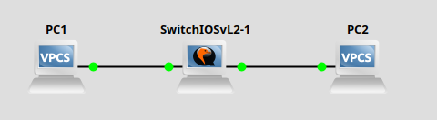

# Laboratory 2 - Layer 2 và VLAN-Security
## I. Giới thiệu
- Cấu hình VLAN, trunk.
- Gán cổng VLAN cho thiết bị đầu cuối (VPCS).
- Cấu hình bảo mật Layer 2: Port Security, DHCP Snooping.
- Kiểm tra bằng lệnh ping từ VPCS
## II. Công cụ
- Cisco IOSvL2: [https://drive.google.com/file/d/1QT7dqDeaQsTnzM7jD-_9ucr1p6mxLZh0/view](https://drive.google.com/file/d/1QT7dqDeaQsTnzM7jD-_9ucr1p6mxLZh0/view)
## III. Cài đặt công cụ:
Cấu hình Cisco IOSvL2
- Mở GNS3 -> Edit -> References ... -> Qemu VMs -> New -> Run this Qemu VM on the GNS3 VM -> đặt tên bắt kỳ cho Switch ảo -> qemu-system-x86_64 -> Telnet -> New Image -> chọn đường dẫn đến file IOSvL2 tải về -> Finish
## IV. Mô hình mạng thực hành:

## V. Nội dung thực hành
1. Cấu hình Switch IOSvL2 (SW1)
```
vIOS-L2-01>enable
vIOS-L2-01#conf t
```
- Tạo VLANs
```
vIOS-L2-01(config)#vlan 10
vIOS-L2-01(config-vlan)#name SALES
vIOS-L2-01(config-vlan)#exit
vIOS-L2-01(config)#vlan 20
vIOS-L2-01(config-vlan)#name IT
vIOS-L2-01(config-vlan)#exit
```
- Gán cổng cho VPCS
```
vIOS-L2-01(config)#interface GigabitEthernet0/0
vIOS-L2-01(config-if)#switchport mode access
vIOS-L2-01(config-if)#switchport access vlan 10
vIOS-L2-01(config-if)#exit

vIOS-L2-01(config)#interface GigabitEthernet0/1
vIOS-L2-01(config-if)#switchport mode access
vIOS-L2-01(config-if)#switchport access vlan 20
vIOS-L2-01(config-if)#exit
```
- Cổng kết nối Router (Router-on-a-Stick)
```
vIOS-L2-01(config)#interface GigabitEthernet0/2
vIOS-L2-01(config-if)#switchport trunk encapsulation dot1q
vIOS-L2-01(config-if)#switchport mode trunk
vIOS-L2-01(config-if)#exit

```
2. Cấu hình IP trên VPCS
- VPCS1 (VLAN 10): `ip 192.168.10.10/24 192.168.10.254`
- VPCS2 (VLAN 20): `ip 192.168.20.10/24 192.168.20.254`
3. Cấu hình Router:
```
R1#enable
R1#conf t
```
- Subinterface cho VLAN 10
```
R1(config)#interface FastEthernet0/0.10
R1(config-subif)#encapsulation dot1Q 10
R1(config-subif)#ip address 192.168.10.254 255.255.255.0
R1(config-subif)#exit
```
- Subinterface cho VLAN 20
```
R1(config)#interface FastEthernet0/0.20
R1(config-subif)#encapsulation dot1Q 20
R1(config-subif)#ip address 192.168.20.254 255.255.255.0
R1(config-subif)#exit
```
-  Bật cổng chính
```
R1(config)#interface FastEthernet0/0
R1(config-if)#no shutdown
R1(config-if)#exit
R1(config)#end
R1#write memory
```
4. Kiểm tra kết nối (ping 2 VPCs được với nhau)
5. Thêm bảo mật Layer 2
- Cấu hình trên switch IOSvL2:
```
vIOS-L2-01#conf t
vIOS-L2-01(config)#interface gigabitEthernet0/0
vIOS-L2-01(config-if)#switchport mode access
vIOS-L2-01(config-if)#switchport access  vlan 10
vIOS-L2-01(config-if)#switchport port-security
vIOS-L2-01(config-if)#switchport port-security maximum 1
vIOS-L2-01(config-if)#switchport port-security violation restrict
vIOS-L2-01(config-if)#switchport port-security mac-address sticky

vIOS-L2-01(config)#interface gigabitEthernet0/1
vIOS-L2-01(config-if)#switchport mode access
vIOS-L2-01(config-if)#switchport access  vlan 20
vIOS-L2-01(config-if)#switchport port-security
vIOS-L2-01(config-if)#switchport port-security maximum 1
vIOS-L2-01(config-if)#switchport port-security violation restrict
vIOS-L2-01(config-if)#switchport port-security mac-address sticky
```
- Giải thích:

maximum 1: chỉ cho 1 MAC trên mỗi cổng.

violation restrict: khi có MAC vi phạm, chặn truy cập, ghi log, không tắt cổng.

mac-address sticky: switch tự học địa chỉ MAC đầu tiên và lưu lại.

- Kiểm tra:`vIOS-L2-01#show port-security interface gigabitEthernet0/1`
- Tình huống thử nghiệm (đơn giản):

Ngắt kết nối VPCS1 khỏi Fa0/1 → Kết nối lại VPCS3 vào Fa0/1.

Nếu VPCS3 có MAC khác → switch sẽ chặn, không cho vào mạng.

