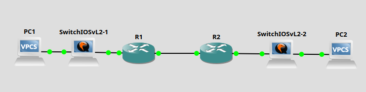

# Laboratory 4 - Site-to-Site-IPsec-VPN, CBAC
## I. Giới thiệu
- Cấu hình VPN kiểu site-to-site sử dụng IPsec để mã hóa dữ liệu giữa hai mạng LAN.
- Áp dụng chính sách lọc lưu lượng có trạng thái (CBAC) để kiểm soát truy cập vào/ra mạng nội bộ.
- Sử dụng Wireshark để quan sát sự khác biệt giữa lưu lượng mã hóa và không mã hóa.
- Hiểu vai trò của VPN và tường lửa theo trạng thái trong bảo vệ hệ thống mạng.
## II. Các công cụ cần thiết
- Sử dụng các cộng cụ bài tập trước
- Wireshark: [https://www.wireshark.org/download.html](https://www.wireshark.org/download.html)
## III. Mô hình mạng thực hành

## IV. Nội dung thực hành
1.Site-to-Site IPsec VPN
- Cấu hình địa chỉ IP cho các router, PC, và kiểm tra kết nối mạng.

Site A LAN: 192.168.10.0/24

Site B LAN: 192.168.20.0/24

WAN: 172.16.0.0/30
- Cấu hình IKE Phase 1 (ISAKMP policy):
```
crypto isakmp policy 10
 encr aes
 hash sha
 authentication pre-share
 group 2
 lifetime 86400
```
- Khai báo key chia sẻ trước:
```
crypto isakmp key vpn123 address 172.16.0.2
```
- Cấu hình IKE Phase 2 (IPsec transform-set và crypto map):
```
crypto ipsec transform-set VPN-SET esp-aes esp-sha-hmac
crypto map VPN-MAP 10 ipsec-isakmp
 set peer 172.16.0.2
 set transform-set VPN-SET
 match address 101
```
- Access-list để chỉ định lưu lượng mã hóa:
```
access-list 101 permit ip 192.168.10.0 0.0.0.255 192.168.20.0 0.0.0.255
```

- Áp dụng crypto map vào giao diện WAN:

```
interface s0/0
 crypto map VPN-MAP
```
- Lặp lại cấu hình trên R2 (đảo chiều IP)
- Kiểm tra kết nối từ PC-A1 đến PC-B1:

Ping kiểm tra.

Dùng Wireshark để quan sát IPsec tunnel (ESP).

2. CBAC – Context-Based Access Control
- Kích hoạt CBAC trên router biên (R1 hoặc R2):

```
ip inspect name FIREWALL tcp
ip inspect name FIREWALL udp
```
- Áp dụng vào giao diện:
```
interface s0/0
 ip inspect FIREWALL out

interface fa0/0
 ip access-group 100 in
```
- Access-list chỉ cho phép lưu lượng đã được kiểm duyệt:
```
access-list 100 permit tcp any any established
access-list 100 deny ip any any log
```
- Kiểm tra trạng thái kết nối và kiểm tra log CBAC:

Từ PC-A1 truy cập web hoặc SSH đến PC-B1.

Từ PC-B1 kết nối ngược phải bị chặn.


