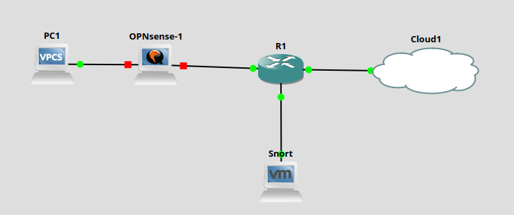

# Laboratory 6 - Firewall Và IPS
## I. Giới thiệu:
- Hiểu cách hoạt động và vai trò của tường lửa và hệ thống IDS/IPS.
- Cấu hình tường lửa cisco access-list cơ bản trong GNS3.
- Triển khai và thử nghiệm Snort (IDS/IPS mã nguồn mở) trên máy ảo Ubuntu.
- Quan sát hành vi phát hiện và ngăn chặn các tấn công giả lập.
## II. Công cụ:
- Sử dụng các công cụ bài tập trước
- Snort / Suricata: Hệ thống phát hiện xâm nhập
## III. Mô hình

## IV. Nội dung thực hành
1. Cấu hình cơ bản Tường lửa
2. 
Trên router hoặc firewall Cisco trong GNS3:

a) Tạo access-list lọc lưu lượng:
```
access-list 100 deny tcp any any eq 23
access-list 100 permit ip any any
```
b) Gắn vào giao diện mạng nội bộ:
```
interface fa0/1
ip access-group 100 in
```
c) Kiểm tra lệnh telnet từ attacker:
```
telnet 192.168.10.10
```
d) Quan sát tường lửa chặn dịch vụ Telnet.

2. Cài đặt Snort làm hệ thống IDS

Trên máy ảo Ubuntu (VMware/VirtualBox):

a) Cài Snort:
```
sudo apt update
sudo apt install snort
```
b) Cấu hình Snort ở chế độ IDS (NIDS):

Sửa snort.conf để lắng nghe trên card mạng

Kích hoạt rule phát hiện scan (portscan, ping, v.v.)

c) Chạy Snort:
```
sudo snort -A console -i eth0 -c /etc/snort/snort.conf -K ascii
```
d) Thực hiện tấn công từ attacker (ping, nmap):
```
nmap -sS 192.168.10.0/24
```
e) Quan sát cảnh báo hiển thị trong Snort.

3. Chuyển Snort sang chế độ IPS (tuỳ chọn nâng cao)

a) Cấu hình Snort để chặn gói tin (inline mode):

Sử dụng NFQUEUE hoặc iptables chuyển hướng về Snort.

b) Tạo rule tùy chỉnh để chặn nmap scan:
```
alert tcp any any -> any any (msg:"NMAP scan detected"; flags:S; sid:1000001;)
```
c) Kiểm tra Snort chặn các tấn công cụ thể.

